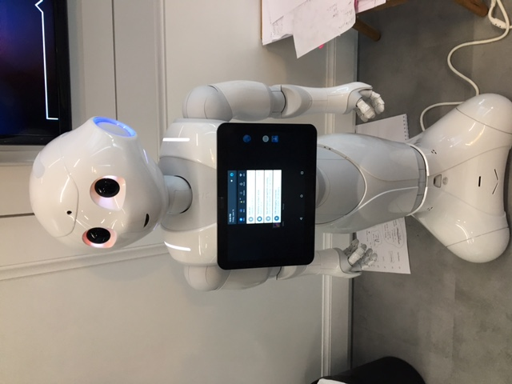
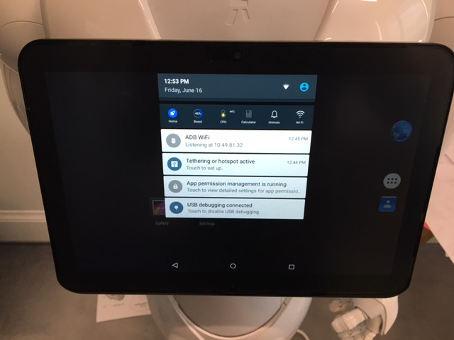

# pepper-tablet-jailbreak
This is a pepper Application that makes the Android Tablet usable on a Pepper 1.8a. So you can use it for debugging, install android apps on it, … 

## Background
For a few years now Softbank Robotics builds Pepper an humanoid robot with an android tablet. But since back then the Android tablet can't be used to actually run apps on it. Today when you want to use the android tablet you have to use a service on peppers main computer (the computer in peppers head) to display stuff on Pepper. Then they send adb commands to the tablet and you can display things like webviews (but not webkit or somthing ^^), images and videos (but max 15sec due to some technical limitations). But adb is really not made to communicate to a tablet in production. Often the tablet looses the connection and the webview on Pepper freezes. Because the Softbank Support couldn't help us for months, we had to hack our Pepper to install real android apps on it…

## How we did it
First of all we connected to pepper via ssh and looked trough stuff like the bootloaders and lots of shitty python code.At some point we found out how the tablet connection works and how we could kill applications on the tablet. This allowed us to remove the custom Applauncher made by Softbank and replaced it with the default android launcher. Then we installed Kingo SuperUser and Termux on the tablet (as sdks) and rooted it with Kingo. This was necessary to get remote adb connections up and running. Afterwards we could just connect to pepper via android-studio (with the Pepper Plugin) and connect to the robot tablet. When you want to use the normal webview again just start the Application and after a few seconds the ALTabletService should be up again. But if you started the ADB Remote debugger before you do this you can still use the adb shell, however, we do not know if this will still be a rooted shell or if the adb shell will reboot itself.

## Faster bootups
This is granted since you really don't have to wait for everything to load up on boot, you'll just go to a direct Android shell.

## Step by step
Run provided code in Choregraphe, follow instructions given by Pepper. And yes, it really takes a fuck load of time to boot because this hack deletes a service that Pepper technically requires to boot faster, but makes you lose all access to the tablet. So, if you do want to get everything back to normal, just run the Bootstrap loader by Alderan and everything will reinstall as normal. You can also set it up like we have, which is the normal method but we kind of have fast fingers so we changed the launcher to Launcher3 and kept all default shit installed. Warning however, keeping the default "shell" of Pepper offline makes it wait the whole 8-9 minutes of downtime. When she stands up, you're good to go :)

Things used:
- Kingoroot
- ADB Wifi Reborn

Both of these things will be installed natively when you run the hack, however, you'll need to manually root the device, so just open Kingoroot and do it. (It might fail the 1st time, so just do it again.).
As for ADB Wifi, just allow it root access and enable it and it's ready.

